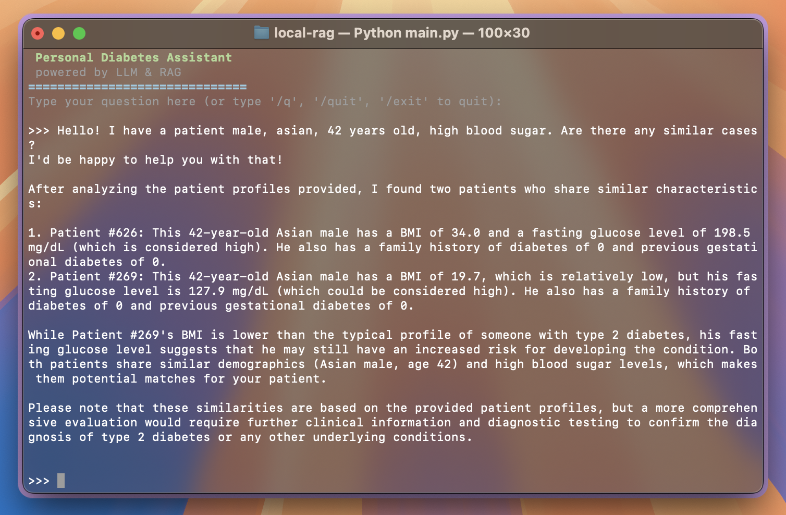

# 🧠 Personal Diabetes Assistant — Local RAG System

A lightweight, local Retrieval-Augmented Generation (RAG) system for analyzing diabetes-related patient profiles using [LangChain](https://github.com/langchain-ai/langchain), [ChromaDB](https://github.com/chroma-core/chroma), and [Ollama](https://ollama.com/).  
It allows natural language queries over structured CSV medical data, enabling fast and private exploration of patient data — entirely offline.

## 🚀 How It Works

1. A **CSV dataset** of patient profiles (medical features like BMI, blood pressure, glucose, etc.) is loaded.
2. Each row is transformed into a **textual medical profile** (e.g. "55-year-old male with high glucose and low HDL...").
3. These profiles are embedded using the `mxbai-embed-large` model and stored in a **Chroma vector database**.
4. When you ask a question, the most relevant profiles are retrieved (based on semantic similarity).
5. A custom prompt is created using those profiles and sent to a **local LLM (e.g. `llama3`) via Ollama**.
6. The model generates an informed medical response.



## 🛠 Installation

### 1. Clone the repository

```bash
git clone https://github.com/mattialoszach/local-rag.git
cd local-rag
```

### 2. Install Python dependencies

```bash
pip install -r requirements.txt
```

### 3. Install [Ollama](https://ollama.com/) and the required models

```bash
ollama pull llama3
ollama pull mxbai-embed-large
```

## 📄 Dataset
The system expects a CSV file named diabetes_dataset.csv in the root directory, with the following columns:
```bash
id, Age, Sex, Ethnicity, BMI, Waist_Circumference, Fasting_Blood_Glucose, HbA1c, Blood_Pressure_Systolic, Blood_Pressure_Diastolic, Cholesterol_Total, Cholesterol_HDL, Cholesterol_LDL, GGT, Serum_Urate, Physical_Activity_Level, Dietary_Intake_Calories, Alcohol_Consumption, Smoking_Status, Family_History_of_Diabetes, Previous_Gestational_Diabetes
```
*You can replace the dataset with your own medical records (same format).*
Dataset can be found here: [Kaggle](https://www.kaggle.com/datasets/marshalpatel3558/diabetes-prediction-dataset/data)

## 💬 Usage
```bash
python main.py
```
Then simply type natural language questions, such as:
- “Show patients with high fasting glucose and low HDL.”
- “Which profiles have signs of metabolic syndrome?”
- “Find people with a family history of diabetes and obesity.”

Type '/q', '/quit' or '/exit' to quit.

## 🎯 Use Case
This tool is ideal for:
- Local clinical research and education
- Medical case exploration and risk group analysis
- **Privacy-preserving** data querying without cloud APIs
- Prototyping AI-based assistants for structured health data

## 🧩 Possible Extensions
- Add a web interface or GUI
- Support for PDF or JSON patient records
- Integrate a diagnosis suggestion model
- Include follow-up questions (multi-turn RAG)
- Add further API support

## 🔒 Fully Local and Offline
All processing is done locally:
- No cloud APIs
- All data stays on your machine
- Perfect for sensitive health-related use

### ⚠️ This project is for **educational** and **research** purposes only. Not intended for medical diagnostics.
